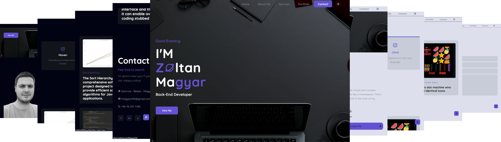
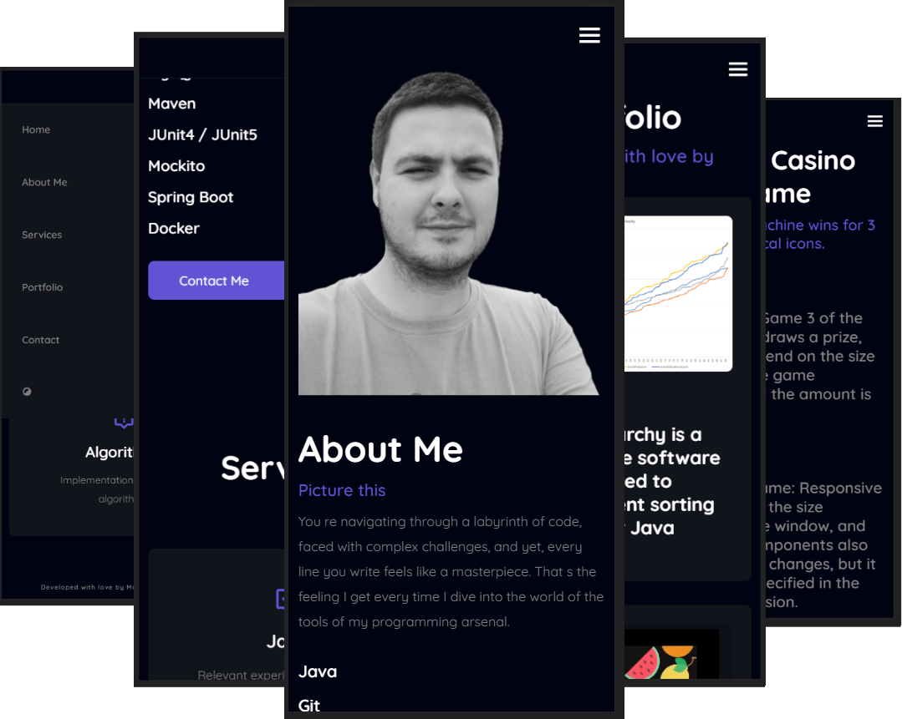

[][license]

# Portfolio Page

## Feature
- Language: `Java 17`, `HTML5`, `CSS`, `JavaScript`
- Project: `Maven 4.0.0`
- Spring Boot: `3.1.2`
- Database: `h2 2.1.214`
- Test: `JUnit5`
- Library: `Lombok 1.18.28`
- Template engine: `Thymeleaf 3.1.2`
---

[][portfolio]

[][portfolioPhone]

---

### Author
Magyar Zoltán

### Contact
magyarz95@gmail.com

[license]: https://www.apache.org/licenses/LICENSE-2.0
[portfolio]: image/Portfolio.png
[portfolioPhone]: image/PortfolioPhone.png